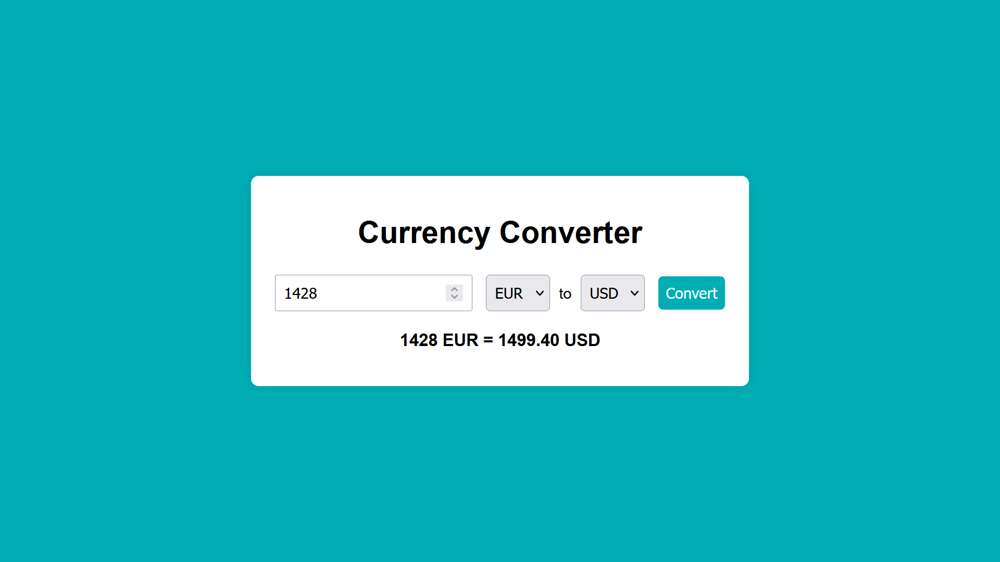

# Currency Converter Web App

A simple web-based Currency Converter built using HTML, CSS, and JavaScript. It uses the [ExchangeRate-API](https://www.exchangerate-api.com/) to fetch real-time exchange rates for currency conversion.

## 🚀 Features
- Convert between multiple currencies (USD, EUR, SAR, JPY, etc.).
- Easy-to-use interface.
- Real-time exchange rate data.

## 🔧 Installation
1. Clone the repository:

    ```bash
    git clone https://github.com/marwan-ahmed-23/currency-converter-js.git
    ```

2. Open the `index.html` file in any browser.

## 📖 Usage

1. Enter the amount you want to convert.
2. Choose the "from" and "to" currencies.
3. Click "Convert" to see the result.

## 📸 Demo



## Dependencies

- JavaScript Fetch API (no external libraries required).


## Future Enhancements

- Add more currencies.
- Support offline mode.
- Improve error handling and UI design.

## 📂 Directory Structure
```plaintext
currency-converter-js/
├── assets/
│   ├── screenshot.png
│   └── style.css
├── index.html
├── License
├── script.js
└── README.md
```

## 🤝 Contributing

Contributions are welcome! Feel free to fork the repository and submit a pull request.

## 🌟 Show Your Support
If you found this project helpful, please consider giving it a ⭐ on GitHub. Your support means the world to us!
